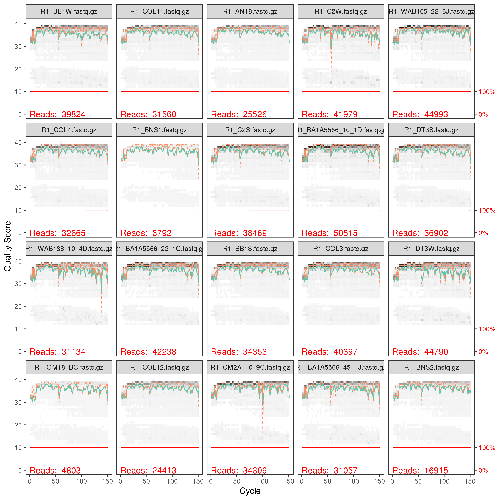
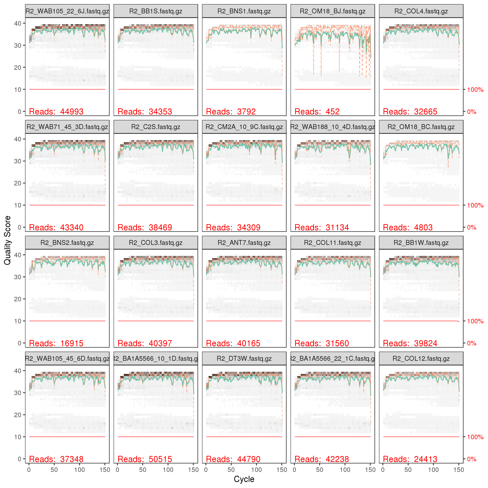

# dada2 tutorial with MiSeq dataset for Fierer Lab 


This version runs the dada2 workflow for Big Data (paired-end) from Rstudio on the microbe server.

We suggest opening the dada2 tutorial online to understand more about each step. The original pipeline on which this tutorial is based can be found here: [https://benjjneb.github.io/dada2/bigdata_paired.html](https://benjjneb.github.io/dada2/bigdata_paired.html)
   

| <span> |
| :--- |
| **NOTE:** There is a slightly different pipeline for ITS and non-"Big data" workflows. The non-"Big data" pipeline, in particular, has very nice detailed explanations for each step and can be found here: [https://benjjneb.github.io/dada2/tutorial.html](https://benjjneb.github.io/dada2/tutorial.html) |
| <span> |


## Set up (part 1) - Steps before starting pipeline ##

If you are running it through fierer lab "microbe" server:
#### Logging in: 

To use the microbe server, open a terminal window, and type and hit return:

```bash    
ssh <your microbe user name>@microbe.colorado.edu 
```

#### For your first time:

*Setting up your password:*

When you log in for the first time, you will have to set a new password. First, log in using your temporary password. The command prompt will then ask you to write a new password. Type it in once and hit return, then type it in again to verify. When you set a new password, make sure that it is something secure (i.e. has at least letters and numbers in it). Note, nothing will show up on the screen when you enter passwords.

Important: Please be respectful and do not give your PW out to other people. The server is currently accessible to the whole world, so if your PW falls into the wrong hands, this will make a lot more work for the folks who administer the server.

#### Downloading this tutorial from github
Once you have logged in, you can download a copy of the tutorial into your directory on the server. To retrieve the folder with this tutorial from github directly to the server, type the following into your terminal and hit return.

```bash    
git clone https://github.com/amoliverio/dada2_fiererlab.git
```
If there are ever updates to the tutorial on github, you can update the contents of this folder by typing:

```bash 
cd dada2_fiererlab # change into the directory first
git pull
```


#### Login to RStudio on the server 

   1. Open a your web browser and start a new empty tab
   2. Type `microbe.colorado.edu:8787` in the address bar
   3. Use your server login credentials to log into rstudio server

If you are running it on your own computer (runs slower!):

1. Download this tutorial from github. Go to [the homepage](https://github.com/amoliverio/dada2_fiererlab), and click the green "Clone or download" button. Then click "Download ZIP", to save it to your computer. Unzip the file to access the R-script.
2. Download the tutorial data from here [http://cme.colorado.edu/projects/bioinformatics-tutorials](http://cme.colorado.edu/projects/bioinformatics-tutorials)
3. Install idemp and cutadapt. 
    - idemp can be found here: [https://github.com/yhwu/idemp](https://github.com/yhwu/idemp)
    - cutadapt can be installed from here: [https://cutadapt.readthedocs.io/en/stable/installation.html](https://cutadapt.readthedocs.io/en/stable/installation.html)
4. Download the dada2-formatted reference database of your choice. Link to download here: [https://benjjneb.github.io/dada2/training.html](https://benjjneb.github.io/dada2/training.html)

## Set up (part 2) - You are logged in to Rstudio on server (or have it open on your computer) ##

First open the R script in Rstudio. The R script is located in the tutorial folder you downloaded in the first step. You can navigate to the proper folder in Rstudio by clicking on the files tab and navigating to the location where you downloaded the github folder. Then click dada2_fiererlab and dada2_tutorial_16S.R to open the R  script.

Now, install DADA2 & other necessary packages. If this is your first time on Rstudio server, when you install a package you might get a prompt asking if you want to create your own library. Answer 'yes' twice in the console to continue.

| <span> |
| :--- |
| **WARNING:** This installation may take a long time, so only run this code if these packages are not already installed! |
| <span> |


```r
install.packages("BiocManager")
BiocManager::install("dada2", version = "3.8")

source("https://bioconductor.org/biocLite.R")
biocLite("ShortRead")
install.packages("dplyr")
install.packages("ggplot2")
```


Load DADA2 and required packages


```r
library(dada2); packageVersion("dada2")
## [1] '1.10.1'
library(ShortRead)
library(dplyr)
library(ggplot2)
```

Once the packages are installed, you can check to make sure the auxillary
software is working and set up some of the variables that you will need 
along the way.

| <span> |
| :--- | 
| **NOTE:** If you are not working from microbe server, you will need to change the file paths for idemp and cutadapt to where they are stored on your computer/server. |
| <span> |

For this tutorial we will be working with some samples that we obtained 16S amplicon data for, from a Illumina Miseq run. The data for these samples can be found on the CME website. [http://cme.colorado.edu/projects/bioinformatics-tutorials](http://cme.colorado.edu/projects/bioinformatics-tutorials)


```r
# Set up pathway to idemp (demultiplexing tool) and test
idemp <- "/usr/bin/idemp" # CHANGE ME if not on microbe
system2(idemp) # Check that idemp is in your path and you can run shell commands from R

# Set up pathway to cutadapt (primer trimming tool) and test
cutadapt <- "/usr/local/Python27/bin/cutadapt" # CHANGE ME if not on microbe
system2(cutadapt, args = "--version") # Check by running shell command from R

# Set path to shared data folder and contents
data.fp <- "/data/shared/2019_02_20_MicrMethods_tutorial"


# List all files in shared folder to check path
list.files(data.fp)
##  [1] "barcode_demultiplex_short.txt"                                                
##  [2] "CompletedJobInfo.xml"                                                         
##  [3] "GenerateFASTQRunStatistics.xml"                                               
##  [4] "Molecular_Methods_18_515fBC_16S_Mapping_File_SHORT_vFinal_Fierer_10252018.txt"
##  [5] "other_files"                                                                  
##  [6] "RunInfo.xml"                                                                  
##  [7] "runParameters.xml"                                                            
##  [8] "Undetermined_S0_L001_I1_001.fastq.gz"                                         
##  [9] "Undetermined_S0_L001_R1_001.fastq.gz"                                         
## [10] "Undetermined_S0_L001_R2_001.fastq.gz"

# Set file paths for barcodes file, map file, and fastqs
    # Barcodes need to have 'N' on the end of each 12bp sequence for compatability
barcode.fp <- file.path(data.fp, "barcode_demultiplex_short.txt") # .txt file: barcode </t> sampleID
map.fp <- file.path(data.fp, "Molecular_Methods_18_515fBC_16S_Mapping_File_SHORT_vFinal_Fierer_10252018.txt")
I1.fp <- file.path(data.fp, "Undetermined_S0_L001_I1_001.fastq.gz") 
R1.fp <- file.path(data.fp, "Undetermined_S0_L001_R1_001.fastq.gz") 
R2.fp <- file.path(data.fp, "Undetermined_S0_L001_R2_001.fastq.gz") 
```

| <span> |
| :--- | 
| **NOTE:** idemp relies on having a match in length between the index file and and the barcode sequences. Since the index file includes a extra linker basepair, you should append the barcode sequences with "N" to make sure each is 13bp long. |
| <span> |

Set up file paths in YOUR directory where you want data; 
you do not need to create the subdirectories but they are nice to have
for organizational purposes. 


```r
project.fp <- "/data/hollandh/MicroMethods_dada2_tutorial" # CHANGE ME to project directory; don't append with a "/"


# Set up names of sub directories to stay organized
preprocess.fp <- file.path(project.fp, "01_preprocess")
    demultiplex.fp <- file.path(preprocess.fp, "demultiplexed")
    filtN.fp <- file.path(preprocess.fp, "filtN")
    trimmed.fp <- file.path(preprocess.fp, "trimmed")
filter.fp <- file.path(project.fp, "02_filter") 
table.fp <- file.path(project.fp, "03_tabletax") 
```

## Pre-processing data for dada2 - demultiplex, remove sequences with Ns, cutadapt 

#### Call the demultiplexing script
Demultiplexing splits your reads out into separate files based on the barcodes associated with each sample. 


```r
flags <- paste("-b", barcode.fp, "-I1", I1.fp, "-R1", R1.fp, "-R2", R2.fp, "-o", demultiplex.fp) 
system2(idemp, args = flags) 

# Look at output of demultiplexing
list.files(demultiplex.fp)
##  [1] "Undetermined_S0_L001_I1_001.fastq.gz.decode"                 
##  [2] "Undetermined_S0_L001_I1_001.fastq.gz.decode.stat"            
##  [3] "Undetermined_S0_L001_R1_001.fastq.gz_ANT7.fastq.gz"          
##  [4] "Undetermined_S0_L001_R1_001.fastq.gz_ANT8.fastq.gz"          
##  [5] "Undetermined_S0_L001_R1_001.fastq.gz_BA1A5566_10_1D.fastq.gz"
##  [6] "Undetermined_S0_L001_R1_001.fastq.gz_BA1A5566_22_1C.fastq.gz"
##  [7] "Undetermined_S0_L001_R1_001.fastq.gz_BA1A5566_45_1J.fastq.gz"
##  [8] "Undetermined_S0_L001_R1_001.fastq.gz_BB1S.fastq.gz"          
##  [9] "Undetermined_S0_L001_R1_001.fastq.gz_BB1W.fastq.gz"          
## [10] "Undetermined_S0_L001_R1_001.fastq.gz_BNS1.fastq.gz"          
## [11] "Undetermined_S0_L001_R1_001.fastq.gz_BNS2.fastq.gz"          
## [12] "Undetermined_S0_L001_R1_001.fastq.gz_C2S.fastq.gz"           
## [13] "Undetermined_S0_L001_R1_001.fastq.gz_C2W.fastq.gz"           
## [14] "Undetermined_S0_L001_R1_001.fastq.gz_CM2A_10_9C.fastq.gz"    
## [15] "Undetermined_S0_L001_R1_001.fastq.gz_CM2A_22_9J.fastq.gz"    
## [16] "Undetermined_S0_L001_R1_001.fastq.gz_COL11.fastq.gz"         
## [17] "Undetermined_S0_L001_R1_001.fastq.gz_COL12.fastq.gz"         
## [18] "Undetermined_S0_L001_R1_001.fastq.gz_COL3.fastq.gz"          
## [19] "Undetermined_S0_L001_R1_001.fastq.gz_COL4.fastq.gz"          
## [20] "Undetermined_S0_L001_R1_001.fastq.gz_DT3S.fastq.gz"          
## [21] "Undetermined_S0_L001_R1_001.fastq.gz_DT3W.fastq.gz"          
## [22] "Undetermined_S0_L001_R1_001.fastq.gz_OM18_BC.fastq.gz"       
## [23] "Undetermined_S0_L001_R1_001.fastq.gz_OM18_BJ.fastq.gz"       
## [24] "Undetermined_S0_L001_R1_001.fastq.gz_unsigned.fastq.gz"      
## [25] "Undetermined_S0_L001_R1_001.fastq.gz_WAB105_22_6J.fastq.gz"  
## [26] "Undetermined_S0_L001_R1_001.fastq.gz_WAB105_45_6D.fastq.gz"  
## [27] "Undetermined_S0_L001_R1_001.fastq.gz_WAB188_10_4D.fastq.gz"  
## [28] "Undetermined_S0_L001_R1_001.fastq.gz_WAB71_45_3D.fastq.gz"   
## [29] "Undetermined_S0_L001_R2_001.fastq.gz_ANT7.fastq.gz"          
## [30] "Undetermined_S0_L001_R2_001.fastq.gz_ANT8.fastq.gz"          
## [31] "Undetermined_S0_L001_R2_001.fastq.gz_BA1A5566_10_1D.fastq.gz"
## [32] "Undetermined_S0_L001_R2_001.fastq.gz_BA1A5566_22_1C.fastq.gz"
## [33] "Undetermined_S0_L001_R2_001.fastq.gz_BA1A5566_45_1J.fastq.gz"
## [34] "Undetermined_S0_L001_R2_001.fastq.gz_BB1S.fastq.gz"          
## [35] "Undetermined_S0_L001_R2_001.fastq.gz_BB1W.fastq.gz"          
## [36] "Undetermined_S0_L001_R2_001.fastq.gz_BNS1.fastq.gz"          
## [37] "Undetermined_S0_L001_R2_001.fastq.gz_BNS2.fastq.gz"          
## [38] "Undetermined_S0_L001_R2_001.fastq.gz_C2S.fastq.gz"           
## [39] "Undetermined_S0_L001_R2_001.fastq.gz_C2W.fastq.gz"           
## [40] "Undetermined_S0_L001_R2_001.fastq.gz_CM2A_10_9C.fastq.gz"    
## [41] "Undetermined_S0_L001_R2_001.fastq.gz_CM2A_22_9J.fastq.gz"    
## [42] "Undetermined_S0_L001_R2_001.fastq.gz_COL11.fastq.gz"         
## [43] "Undetermined_S0_L001_R2_001.fastq.gz_COL12.fastq.gz"         
## [44] "Undetermined_S0_L001_R2_001.fastq.gz_COL3.fastq.gz"          
## [45] "Undetermined_S0_L001_R2_001.fastq.gz_COL4.fastq.gz"          
## [46] "Undetermined_S0_L001_R2_001.fastq.gz_DT3S.fastq.gz"          
## [47] "Undetermined_S0_L001_R2_001.fastq.gz_DT3W.fastq.gz"          
## [48] "Undetermined_S0_L001_R2_001.fastq.gz_OM18_BC.fastq.gz"       
## [49] "Undetermined_S0_L001_R2_001.fastq.gz_OM18_BJ.fastq.gz"       
## [50] "Undetermined_S0_L001_R2_001.fastq.gz_unsigned.fastq.gz"      
## [51] "Undetermined_S0_L001_R2_001.fastq.gz_WAB105_22_6J.fastq.gz"  
## [52] "Undetermined_S0_L001_R2_001.fastq.gz_WAB105_45_6D.fastq.gz"  
## [53] "Undetermined_S0_L001_R2_001.fastq.gz_WAB188_10_4D.fastq.gz"  
## [54] "Undetermined_S0_L001_R2_001.fastq.gz_WAB71_45_3D.fastq.gz"
```

| <span> |
| :--- |
| **WARNING:** The demultiplexing step may take a while. If it takes too long you can safely close RStudio on the server and the demultiplexing will run in the background. You should be able to resume the pipeline after demultiplexing is complete by logging back into RStudio on the server. |
| <span> |

#### Clean up the output from idemp


```r
# Change names of unassignable reads so they are not included in downstream processing
unassigned_1 <- paste0("mv", " ", demultiplex.fp, "/Undetermined_S0_L001_R1_001.fastq.gz_unsigned.fastq.gz",
                       " ", demultiplex.fp, "/Unassigned_reads1.fastq.gz")
unassigned_2 <- paste0("mv", " ", demultiplex.fp, "/Undetermined_S0_L001_R2_001.fastq.gz_unsigned.fastq.gz", 
                       " ", demultiplex.fp, "/Unassigned_reads2.fastq.gz")
system(unassigned_1)
system(unassigned_2)

# Rename files - gsub to get names in order!
R1_names <- gsub(paste0(demultiplex.fp, "/Undetermined_S0_L001_R1_001.fastq.gz_"), "", 
                 list.files(demultiplex.fp, pattern="R1", full.names = TRUE))
file.rename(list.files(demultiplex.fp, pattern="R1", full.names = TRUE), 
            paste0(demultiplex.fp, "/R1_", R1_names))
##  [1] TRUE TRUE TRUE TRUE TRUE TRUE TRUE TRUE TRUE
## [10] TRUE TRUE TRUE TRUE TRUE TRUE TRUE TRUE TRUE
## [19] TRUE TRUE TRUE TRUE TRUE TRUE TRUE

R2_names <- gsub(paste0(demultiplex.fp, "/Undetermined_S0_L001_R2_001.fastq.gz_"), "", 
                 list.files(demultiplex.fp, pattern="R2", full.names = TRUE))
file.rename(list.files(demultiplex.fp, pattern="R2", full.names = TRUE),
            paste0(demultiplex.fp, "/R2_", R2_names))
##  [1] TRUE TRUE TRUE TRUE TRUE TRUE TRUE TRUE TRUE
## [10] TRUE TRUE TRUE TRUE TRUE TRUE TRUE TRUE TRUE
## [19] TRUE TRUE TRUE TRUE TRUE TRUE TRUE

# Get full paths for all files and save them for downstream analyses
# Forward and reverse fastq filenames have format: 
fnFs <- sort(list.files(demultiplex.fp, pattern="R1_", full.names = TRUE))
fnRs <- sort(list.files(demultiplex.fp, pattern="R2_", full.names = TRUE))
```

#### Pre-filter to remove sequence reads with Ns
Ambiguous bases will make it hard for cutadapt to find short primer sequences in the reads.
To solve this problem, we will remove sequences with ambiguous bases (Ns)


```r
# Name the N-filtered files to put them in filtN/ subdirectory
fnFs.filtN <- file.path(preprocess.fp, "filtN", basename(fnFs))
fnRs.filtN <- file.path(preprocess.fp, "filtN", basename(fnRs))

# Filter Ns from reads and put them into the filtN directory
filterAndTrim(fnFs, fnFs.filtN, fnRs, fnRs.filtN, maxN = 0, multithread = TRUE) 
## Error in names(answer) <- names1: 'names' attribute [25] must be the same length as the vector [24]
# CHANGE multithread to FALSE on Windows (here and elsewhere in the program)
```

#### Prepare the primers sequences and custom functions for analyzing the results from cutadapt
Assign the primers you used to "FWD" and "REV" below. Note primers should be not be reverse complemented ahead of time. Our tutorial data uses 515f and 806br those are the primers below. Change if you sequenced with other primers.


```r
# Set up the primer sequences to pass along to cutadapt
FWD <- "GTGYCAGCMGCCGCGGTAA"  ## CHANGE ME # this is 515f
REV <- "GGACTACNVGGGTWTCTAAT"  ## CHANGE ME # this is 806Br

# Write a function that creates a list of all orientations of the primers
allOrients <- function(primer) {
    # Create all orientations of the input sequence
    require(Biostrings)
    dna <- DNAString(primer)  # The Biostrings works w/ DNAString objects rather than character vectors
    orients <- c(Forward = dna, Complement = complement(dna), Reverse = reverse(dna), 
                 RevComp = reverseComplement(dna))
    return(sapply(orients, toString))  # Convert back to character vector
}

# Save the primer orientations to pass to cutadapt
FWD.orients <- allOrients(FWD)
REV.orients <- allOrients(REV)
FWD.orients
##               Forward            Complement 
## "GTGYCAGCMGCCGCGGTAA" "CACRGTCGKCGGCGCCATT" 
##               Reverse               RevComp 
## "AATGGCGCCGMCGACYGTG" "TTACCGCGGCKGCTGRCAC"

# Write a function that counts how many time primers appear in a sequence
primerHits <- function(primer, fn) {
    # Counts number of reads in which the primer is found
    nhits <- vcountPattern(primer, sread(readFastq(fn)), fixed = FALSE)
    return(sum(nhits > 0))
}
```

Before running cutadapt, we will look at primer detection
for the first sample, as a check. There may be some primers here, we will remove them below using cutadapt.


```r
rbind(FWD.ForwardReads = sapply(FWD.orients, primerHits, fn = fnFs.filtN[[1]]), 
      FWD.ReverseReads = sapply(FWD.orients, primerHits, fn = fnRs.filtN[[1]]), 
      REV.ForwardReads = sapply(REV.orients, primerHits, fn = fnFs.filtN[[1]]), 
      REV.ReverseReads = sapply(REV.orients, primerHits, fn = fnRs.filtN[[1]]))
##                  Forward Complement Reverse RevComp
## FWD.ForwardReads       2          0       0       0
## FWD.ReverseReads       0          0       0      35
## REV.ForwardReads       0          0       0      56
## REV.ReverseReads       0          0       0       0
```

#### Remove primers with cutadapt and assess the output


```r
# Create directory to hold the output from cutadapt
if (!dir.exists(trimmed.fp)) dir.create(trimmed.fp)
fnFs.cut <- file.path(trimmed.fp, basename(fnFs))
fnRs.cut <- file.path(trimmed.fp, basename(fnRs))

# Save the reverse complements of the primers to variables
FWD.RC <- dada2:::rc(FWD)
REV.RC <- dada2:::rc(REV)

##  Create the cutadapt flags ##
# Trim FWD and the reverse-complement of REV off of R1 (forward reads)
R1.flags <- paste("-g", FWD, "-a", REV.RC, "--minimum-length 50") 

# Trim REV and the reverse-complement of FWD off of R2 (reverse reads)
R2.flags <- paste("-G", REV, "-A", FWD.RC, "--minimum-length 50") 

# Run Cutadapt
for (i in seq_along(fnFs)) {
    system2(cutadapt, args = c(R1.flags, R2.flags, "-n", 2, # -n 2 required to remove FWD and REV from reads
                               "-o", fnFs.cut[i], "-p", fnRs.cut[i], # output files
                               fnFs.filtN[i], fnRs.filtN[i])) # input files
}

# As a sanity check, we will check for primers in the first cutadapt-ed sample:
    ## should all be zero!
rbind(FWD.ForwardReads = sapply(FWD.orients, primerHits, fn = fnFs.cut[[1]]), 
      FWD.ReverseReads = sapply(FWD.orients, primerHits, fn = fnRs.cut[[1]]), 
      REV.ForwardReads = sapply(REV.orients, primerHits, fn = fnFs.cut[[1]]), 
      REV.ReverseReads = sapply(REV.orients, primerHits, fn = fnRs.cut[[1]]))
##                  Forward Complement Reverse RevComp
## FWD.ForwardReads       0          0       0       0
## FWD.ReverseReads       0          0       0       0
## REV.ForwardReads       0          0       0       0
## REV.ReverseReads       0          0       0       0
```

# Now start DADA2 pipeline


```r
# Put filtered reads into separate sub-directories for big data workflow
dir.create(filter.fp)
    subF.fp <- file.path(filter.fp, "preprocessed_F") 
    subR.fp <- file.path(filter.fp, "preprocessed_R") 
dir.create(subF.fp)
dir.create(subR.fp)

# Move R1 and R2 from trimmed to separate forward/reverse sub-directories
fnFs.Q <- file.path(subF.fp,  basename(fnFs)) 
fnRs.Q <- file.path(subR.fp,  basename(fnRs))
file.rename(from = fnFs.cut, to = fnFs.Q)
##  [1] TRUE TRUE TRUE TRUE TRUE TRUE TRUE TRUE TRUE TRUE TRUE TRUE TRUE TRUE TRUE TRUE TRUE TRUE TRUE TRUE TRUE
## [22] TRUE TRUE TRUE TRUE
file.rename(from = fnRs.cut, to = fnRs.Q)
##  [1] TRUE TRUE TRUE TRUE TRUE TRUE TRUE TRUE TRUE TRUE TRUE TRUE TRUE TRUE TRUE TRUE TRUE TRUE TRUE TRUE TRUE
## [22] TRUE TRUE TRUE TRUE

# File parsing
filtpathF <- file.path(subF.fp, "filtered") # files go into preprocessed_F/filtered/
filtpathR <- file.path(subR.fp, "filtered") # ...
fastqFs <- sort(list.files(subF.fp, pattern="fastq.gz"))
fastqRs <- sort(list.files(subR.fp, pattern="fastq.gz"))
if(length(fastqFs) != length(fastqRs)) stop("Forward and reverse files do not match.")
```

### 1. FILTER AND TRIM FOR QUALITY

Before chosing sequence variants, we want to trim reads where their quality scores begin to drop (the `truncLen` and `truncQ` values) and remove any low-quality reads that are left over after we have finished trimming (the `maxEE` value).

**You will want to change this depending on run chemistry and quality:** For 2x250 bp runs you can try truncLen=c(240,160) (as per the [dada2 tutorial](https://benjjneb.github.io/dada2/tutorial.html#inspect-read-quality-profiles)) if your reverse reads drop off in quality. Or you may want to choose a higher value, for example, truncLen=c(240,200), if they do not. In truncLen=c(xxx,yyy), xxx refers to the forward read truncation length, yyy refers to the reverse read truncation length.

**For ITS data:** Due to the expected variable read lengths in ITS data you should run this command without the trunclen parameter. See here for more information and appropriate parameters for ITS data: [https://benjjneb.github.io/dada2/ITS_workflow.html](https://benjjneb.github.io/dada2/ITS_workflow.html).

*From dada2 tutorial:*
>If there is only one part of any amplicon bioinformatics workflow on which you spend time considering the parameters, it should be filtering! The parameters ... are not set in stone, and should be changed if they don’t work for your data. If too few reads are passing the filter, increase maxEE and/or reduce truncQ. If quality drops sharply at the end of your reads, reduce truncLen. If your reads are high quality and you want to reduce computation time in the sample inference step, reduce  maxEE.
#### Inspect read quality profiles
It's important to get a feel for the quality of the data that we are using. To do this, we will plot the quality of some of the samples.

*From the dada2 tutorial:*
>In gray-scale is a heat map of the frequency of each quality score at each base position. The median quality score at each position is shown by the green line, and the quartiles of the quality score distribution by the orange lines. The red line shows the scaled proportion of reads that extend to at least that position (this is more useful for other sequencing technologies, as Illumina reads are typically all the same lenghth, hence the flat red line).


```r
# If the number of samples is 20 or less, plot them all, otherwise, just plot 20 randomly selected samples
if( length(fastqFs) <= 20) {
  plotQualityProfile(paste0(subF.fp, "/", fastqFs))
  plotQualityProfile(paste0(subR.fp, "/", fastqRs))
} else {
  rand_samples <- sample(size = 20, 1:length(fastqFs)) # grab 20 random samples to plot
  fwd_qual_plots <- plotQualityProfile(paste0(subF.fp, "/", fastqFs[rand_samples]))
  rev_qual_plots <- plotQualityProfile(paste0(subR.fp, "/", fastqRs[rand_samples]))
}

fwd_qual_plots
```



```r
rev_qual_plots
```



```r

# write plots to disk
saveRDS(fwd_qual_plots, paste0(filter.fp, "/fwd_qual_plots.rds"))
saveRDS(rev_qual_plots, paste0(filter.fp, "/rev_qual_plots.rds"))
```

#### Filter the data

| <span> |
| :--- |
| **WARNING:** THESE PARAMETERS ARE NOT OPTIMAL FOR ALL DATASETS. Make sure you determine the trim and filtering parameters for your data. The following settings are generally appropriate for MiSeq runs that are 2x150 bp. See above for more details. |
| <span> |


```r
filt_out <- filterAndTrim(fwd=file.path(subF.fp, fastqFs), filt=file.path(filtpathF, fastqFs),
              rev=file.path(subR.fp, fastqRs), filt.rev=file.path(filtpathR, fastqRs),
              truncLen=c(150,140), maxEE=1, truncQ=11, maxN=0, rm.phix=TRUE,
              compress=TRUE, verbose=TRUE, multithread=TRUE)

# look at the percentage of reads kept
head(filt_out)
##                            reads.in reads.out
## R1_ANT7.fastq.gz              40165     35325
## R1_ANT8.fastq.gz              25526     23028
## R1_BA1A5566_10_1D.fastq.gz    50515     44631
## R1_BA1A5566_22_1C.fastq.gz    42238     37237
## R1_BA1A5566_45_1J.fastq.gz    31057     27081
## R1_BB1S.fastq.gz              34353     30309
# summary of filt_out
filt_out %>% 
  data.frame() %>% 
  mutate(Samples = rownames(.),
         percent_kept = 100*(reads.out/reads.in)) %>%
  select(Samples, everything()) %>%
  summarise(min_remaining = paste0(round(min(percent_kept), 2), "%"), 
            median_remaining = paste0(round(median(percent_kept), 2), "%"),
            mean_remaining = paste0(round(mean(percent_kept), 2), "%"), 
            max_remaining = paste0(round(max(percent_kept), 2), "%"))
##   min_remaining median_remaining mean_remaining max_remaining
## 1        76.33%           87.86%         87.68%        90.85%
```

### 2. INFER sequence variants
In this part of the pipeline dada2 will learn to distinguish error from biological 
differences using a subset of our data as a training set. After it understands the 
error rates, we will reduce the size of the dataset by combining all identical 
sequence reads into "unique sequences". Then, using the dereplicated data and 
error rates, dada2 will infer the sequence variants (OTUs) in our data. Finally, 
we will merge the coresponding forward and reverse reads to create a list of the 
fully denoised sequences and create a sequence table from the result.
#### Housekeeping step - set up and verify the file names for the output:


```r
# File parsing
filtFs <- list.files(filtpathF, pattern="fastq.gz", full.names = TRUE)
filtRs <- list.files(filtpathR, pattern="fastq.gz", full.names = TRUE)

# Sample names in order
sample.names <- substring(basename(filtFs), regexpr("_", basename(filtFs)) + 1) # doesn't drop fastq.gz
sample.names <- gsub(".fastq.gz", "", sample.names)
sample.namesR <- substring(basename(filtRs), regexpr("_", basename(filtRs)) + 1) # doesn't drop fastq.gz
sample.namesR <- gsub(".fastq.gz", "", sample.namesR)

# Double check
if(!identical(sample.names, sample.namesR)) stop("Forward and reverse files do not match.")
names(filtFs) <- sample.names
names(filtRs) <- sample.names
```

#### Learn the error rates


```r
set.seed(100) # set seed to ensure that randomized steps are replicatable

# Learn forward error rates
errF <- learnErrors(filtFs, nbases=1e8, multithread=TRUE)
## 100285500 total bases in 668570 reads from 24 samples will be used for learning the error rates.

# Learn reverse error rates
errR <- learnErrors(filtRs, nbases=1e8, multithread=TRUE)
## 98930580 total bases in 706647 reads from 25 samples will be used for learning the error rates.
```

#### Plot Error Rates
We want to make sure that the machine learning algorithm is learning the error rates properly. In the plots below, the red line represents what we should expect the learned error rates to look like for each of the 16 possible base transitions (A->A, A->C, A->G, etc.) and the black line and grey dots represent what the observed error rates are. If the black line and the red lines are very far off from each other, it may be a good idea to increase the ```nbases``` parameter. This alows the machine learning algorthim to train on a larger portion of your data and may help imporve the fit.


```r
errF_plot <- plotErrors(errF, nominalQ=TRUE)
errR_plot <- plotErrors(errR, nominalQ=TRUE)

errF_plot
```


```r
errR_plot
```


```r

# write to disk
saveRDS(errF_plot, paste0(filtpathF, "/errF_plot.rds"))
saveRDS(errR_plot, paste0(filtpathR, "/errR_plot.rds"))
```

#### Dereplication, sequence inference, and merging of paired-end reads


```r
# make a list to hold the loop output
mergers <- vector("list", length(sample.names))
names(mergers) <- sample.names
ddF <- vector("list", length(sample.names))
names(ddF) <- sample.names
ddR <- vector("list", length(sample.names))
names(ddR) <- sample.names

# For each sample, get a list of merged and denoised sequences
for(sam in sample.names) {
    cat("Processing:", sam, "\n")
    # Dereplicate forward reads
    derepF <- derepFastq(filtFs[[sam]])
    # Infer sequences for forward reads
    dadaF <- dada(derepF, err=errF, multithread=TRUE)
    ddF[[sam]] <- dadaF
    # Dereplicate reverse reads
    derepR <- derepFastq(filtRs[[sam]])
    # Infer sequences for reverse reads
    dadaR <- dada(derepR, err=errR, multithread=TRUE)
    ddR[[sam]] <- dadaR
    # Merge reads together
    merger <- mergePairs(ddF[[sam]], derepF, ddR[[sam]], derepR)
    mergers[[sam]] <- merger
}
## Processing: ANT7 
## Sample 1 - 35325 reads in 13771 unique sequences.
## Sample 1 - 35325 reads in 12445 unique sequences.
## Processing: ANT8 
## Sample 1 - 23028 reads in 9427 unique sequences.
## Sample 1 - 23028 reads in 8455 unique sequences.
## Processing: BA1A5566_10_1D 
## Sample 1 - 44631 reads in 9425 unique sequences.
## Sample 1 - 44631 reads in 8788 unique sequences.
## Processing: BA1A5566_22_1C 
## Sample 1 - 37237 reads in 7686 unique sequences.
## Sample 1 - 37237 reads in 6791 unique sequences.
## Processing: BA1A5566_45_1J 
## Sample 1 - 27081 reads in 5702 unique sequences.
## Sample 1 - 27081 reads in 4650 unique sequences.
## Processing: BB1S 
## Sample 1 - 30309 reads in 9402 unique sequences.
## Sample 1 - 30309 reads in 8195 unique sequences.
## Processing: BB1W 
## Sample 1 - 34459 reads in 7473 unique sequences.
## Sample 1 - 34459 reads in 5894 unique sequences.
## Processing: BNS1 
## Sample 1 - 3416 reads in 720 unique sequences.
## Sample 1 - 3416 reads in 625 unique sequences.
## Processing: BNS2 
## Sample 1 - 15266 reads in 3158 unique sequences.
## Sample 1 - 15266 reads in 2845 unique sequences.
## Processing: C2S 
## Sample 1 - 33614 reads in 11811 unique sequences.
## Sample 1 - 33614 reads in 10168 unique sequences.
## Processing: C2W 
## Sample 1 - 36311 reads in 6588 unique sequences.
## Sample 1 - 36311 reads in 4756 unique sequences.
## Processing: CM2A_10_9C 
## Sample 1 - 31169 reads in 3985 unique sequences.
## Sample 1 - 31169 reads in 3233 unique sequences.
## Processing: CM2A_22_9J 
## Sample 1 - 27499 reads in 4126 unique sequences.
## Sample 1 - 27499 reads in 3430 unique sequences.
## Processing: COL11 
## Sample 1 - 27672 reads in 12837 unique sequences.
## Sample 1 - 27672 reads in 11692 unique sequences.
## Processing: COL12 
## Sample 1 - 21930 reads in 10539 unique sequences.
## Sample 1 - 21930 reads in 9472 unique sequences.
## Processing: COL3 
## Sample 1 - 35470 reads in 16585 unique sequences.
## Sample 1 - 35470 reads in 15005 unique sequences.
## Processing: COL4 
## Sample 1 - 28667 reads in 13454 unique sequences.
## Sample 1 - 28667 reads in 12090 unique sequences.
## Processing: DT3S 
## Sample 1 - 31992 reads in 10400 unique sequences.
## Sample 1 - 31992 reads in 9314 unique sequences.
## Processing: DT3W 
## Sample 1 - 38187 reads in 7962 unique sequences.
## Sample 1 - 38187 reads in 6035 unique sequences.
## Processing: OM18_BC 
## Sample 1 - 4171 reads in 965 unique sequences.
## Sample 1 - 4171 reads in 824 unique sequences.
## Processing: OM18_BJ 
## Sample 1 - 345 reads in 98 unique sequences.
## Sample 1 - 345 reads in 81 unique sequences.
## Processing: WAB105_22_6J 
## Sample 1 - 40501 reads in 7319 unique sequences.
## Sample 1 - 40501 reads in 6388 unique sequences.
## Processing: WAB105_45_6D 
## Sample 1 - 33594 reads in 6118 unique sequences.
## Sample 1 - 33594 reads in 5549 unique sequences.
## Processing: WAB188_10_4D 
## Sample 1 - 26696 reads in 4008 unique sequences.
## Sample 1 - 26696 reads in 3289 unique sequences.
## Processing: WAB71_45_3D 
## Sample 1 - 38077 reads in 7700 unique sequences.
## Sample 1 - 38077 reads in 7276 unique sequences.

rm(derepF); rm(derepR)
```

#### Construct sequence table


```r
seqtab <- makeSequenceTable(mergers)

# Save table as an r data object file
dir.create(table.fp)
saveRDS(seqtab, paste0(table.fp, "/seqtab.rds"))
```

### 3. REMOVE Chimeras and ASSIGN Taxonomy
Although dada2 has searched for indel errors and subsitutions, there may still be chimeric
sequences in our dataset (sequences that are derived from forward and reverse sequences from 
two different organisms becoming fused together during PCR and/or sequencing). To identify 
chimeras, we will search for rare sequence variants that can be reconstructed by combining
left-hand and right-hand segments from two more abundant "parent" sequences. After removing chimeras, we will use a taxonomy database to train a classifer-algorithm
to assign names to our sequence variants.

For the tutorial 16S, we will assign taxonomy with Silva db v132, but you might want to use other databases for your data. Below are paths to some of the databases we use often. (If you are on your own computer you can download the database you need from this link https://benjjneb.github.io/dada2/training.html):

16S bacteria and archaea (SILVA db): /db_files/dada2/silva_nr_v132_train_set.fa

ITS fungi (UNITE db): /db_files/dada2/unite_general_release_dynamic_02.02.2019.fasta

18S protists (PR2 db): /db_files/dada2/pr2_version_4.11.1_dada2.fasta


```r
# Read in RDS 
st.all <- readRDS(paste0(table.fp, "/seqtab.rds"))

# Remove chimeras
seqtab.nochim <- removeBimeraDenovo(st.all, method="consensus", multithread=TRUE)

# Print percentage of our seqences that were chimeric.
100*sum(seqtab.nochim)/sum(seqtab)
## [1] 98.31469

# Assign taxonomy
tax <- assignTaxonomy(seqtab, "/db_files/dada2/silva_nr_v132_train_set.fa",
                      multithread=TRUE)

# Write results to disk
saveRDS(seqtab, paste0(table.fp, "/seqtab_final.rds"))
saveRDS(tax, paste0(table.fp, "/tax_final.rds"))
```

### 4. Optional - FORMAT OUTPUT to obtain ESV IDs and repset, and input for mctoolsr
For convenience sake, we will now rename our ESVs with numbers, output our 
results as a traditional taxa table, and create a matrix with the representative
sequences for each ESV. 


```r
# Flip table
seqtab.t <- as.data.frame(t(seqtab))

# Pull out ESV repset
rep_set_ESVs <- as.data.frame(rownames(seqtab.t))
rep_set_ESVs <- mutate(rep_set_ESVs, ESV_ID = 1:n())
rep_set_ESVs$ESV_ID <- sub("^", "ESV_", rep_set_ESVs$ESV_ID)
rep_set_ESVs$ESV <- rep_set_ESVs$`rownames(seqtab.t)` 
rep_set_ESVs$`rownames(seqtab.t)` <- NULL

# Add ESV numbers to table
rownames(seqtab.t) <- rep_set_ESVs$ESV_ID

# Add ESV numbers to taxonomy
taxonomy <- as.data.frame(tax)
taxonomy$ESV <- as.factor(rownames(taxonomy))
taxonomy <- merge(rep_set_ESVs, taxonomy, by = "ESV")
rownames(taxonomy) <- taxonomy$ESV_ID
taxonomy_for_mctoolsr <- unite_(taxonomy, "taxonomy", 
                                c("Kingdom", "Phylum", "Class", "Order","Family", "Genus", "ESV_ID"),
                                sep = ";")
## Error in unite_(taxonomy, "taxonomy", c("Kingdom", "Phylum", "Class", : could not find function "unite_"

# Merge taxonomy and table
seqtab_wTax <- merge(seqtab.t, taxonomy_for_mctoolsr, by = 0)
## Error in merge(seqtab.t, taxonomy_for_mctoolsr, by = 0): object 'taxonomy_for_mctoolsr' not found
seqtab_wTax$ESV <- NULL 
## Error in seqtab_wTax$ESV <- NULL: object 'seqtab_wTax' not found

# Set name of table in mctoolsr format and save
out_fp <- paste0(table.fp, "/seqtab_wTax_mctoolsr.txt")
names(seqtab_wTax)[1] = "#ESV_ID"
## Error in names(seqtab_wTax)[1] = "#ESV_ID": object 'seqtab_wTax' not found
write("#Exported for mctoolsr", out_fp)
suppressWarnings(write.table(seqtab_wTax, out_fp, sep = "\t", row.names = FALSE, append = TRUE))
## Error in is.data.frame(x): object 'seqtab_wTax' not found

# Also export files as .txt
write.table(seqtab.t, file = paste0(table.fp, "/seqtab_final.txt"),
            sep = "\t", row.names = TRUE, col.names = NA)
write.table(tax, file = paste0(table.fp, "/tax_final.txt"), 
            sep = "\t", row.names = TRUE, col.names = NA)
```

### 5. Summary of reads throughout pipeline
Here we track the reads throughout the pipeline to see if any step is resulting in a greater-than-expected loss of reads. If a step is showing a greater than expected loss of reads, it is a good idea to go back to that step and troubleshoot why reads are dropping out. The dada2 tutorial has more details about what can be changed at each step. 


```r
getN <- function(x) sum(getUniques(x)) # function to grab sequence counts from output objects
# tracking reads by counts
track <- cbind(filt_out, 
               sapply(ddF[sample.names], getN), 
               sapply(ddR[sample.names], getN), 
               sapply(mergers, getN), 
               rowSums(seqtab.nochim))
colnames(track) <- c("input", "filtered", "denoisedF", "denoisedR", "merged", "nonchim")
rownames(track) <- sample.names
head(track)
##                input filtered denoisedF denoisedR merged nonchim
## ANT7           40165    35325     33793     33942  28426   28319
## ANT8           25526    23028     21756     21931  17693   17598
## BA1A5566_10_1D 50515    44631     44207     44148  43079   41737
## BA1A5566_22_1C 42238    37237     36826     36905  35888   34227
## BA1A5566_45_1J 31057    27081     26743     26839  26141   23554
## BB1S           34353    30309     29313     29568  26257   26129

# tracking reads by percentage
track_pct <- track %>% 
  data.frame() %>%
  mutate(Sample = rownames(.),
         filtered_pct = 100 * (filtered/input),
         denoisedF_pct = 100 * (denoisedF/filtered),
         denoisedR_pct = 100 * (denoisedR/filtered),
         merged_pct = 100 * merged/((denoisedF + denoisedR)/2),
         nonchim_pct = 100 * (nonchim/merged),
         total_pct = 100 * nonchim/input) %>%
  select(Sample, ends_with("_pct"))

# summary stats of tracked reads averaged across samples
track_pct_avg <- track_pct %>% summarize_at(vars(ends_with("_pct")), 
                           list(avg = mean))
head(track_pct_avg)
##   filtered_pct_avg denoisedF_pct_avg denoisedR_pct_avg merged_pct_avg nonchim_pct_avg total_pct_avg
## 1         87.67735          97.40454          98.05833       91.63946         98.6076      77.56848

# Plotting each sample's reads through the pipeline
track_plot <- track %>% 
  data.frame() %>%
  mutate(Sample = rownames(.)) %>%
  gather(key = "Step", value = "Reads", -Sample) %>%
  mutate(Step = factor(Step, 
                       levels = c("input", "filtered", "denoisedF", "denoisedR", "merged", "nonchim"))) %>%
  ggplot(aes(x = Step, y = Reads)) +
  geom_line(aes(group = Sample), alpha = 0.2) +
  geom_point(alpha = 0.5, position = position_jitter(width = 0)) + 
  stat_summary(fun.y = mean, geom = "line", group = 1, color = "steelblue", size = 1, alpha = 0.5) +
  stat_summary(fun.y = mean, geom = "point", group = 1, color = "steelblue", size = 2) +
  stat_summary(fun.data = median_hilow, fun.args = list(conf.int = 0.5), 
               geom = "ribbon", group = 1, fill = "steelblue", alpha = 0.2) +
  geom_label(data = t(track_pct_avg[1:5]) %>% data.frame() %>% 
               rename(Percent = 1) %>%
               mutate(Step = c("filtered", "denoisedF", "denoisedR", "merged", "nonchim"),
                      Percent = paste(round(Percent, 2), "%")),
             aes(label = Percent), y = 1.1 * max(track[,2])) +
  geom_label(data = track_pct_avg[6] %>% data.frame() %>%
               rename(total = 1),
             aes(label = paste("Total\nRemaining:\n", round(track_pct_avg[1,6], 2), "%")), 
             y = mean(track[,6]), x = 6.5) +
  expand_limits(y = 1.1 * max(track[,2]), x = 7) +
  theme_classic()
## Error in gather(., key = "Step", value = "Reads", -Sample): could not find function "gather"

track_plot
## Error in eval(expr, envir, enclos): object 'track_plot' not found

# Write results to disk
saveRDS(track, paste0(project.fp, "/tracking_reads.rds"))
saveRDS(track_pct, paste0(project.fp, "/tracking_reads_percentage.rds"))
saveRDS(track_plot, paste0(project.fp, "/tracking_reads_summary_plot.rds"))
## Error in saveRDS(track_plot, paste0(project.fp, "/tracking_reads_summary_plot.rds")): object 'track_plot' not found
```

## Final Steps
You can now transfer over the output files onto your local computer. 
The table and taxonomy can be read into R with 'mctoolsr' package as below. 


```r

tax_table_fp = 'mypath/seqtab_wTax_mctoolsr.txt'
map_fp = 'mypath/my_mapfile.txt' 
input = load_taxa_table(tax_table_fp, map_fp)
```

### Post-pipeline considerations
After following this pipline, you will need to think about the following in downstream applications (example with 'mctoolsr' R package below):

1. Remove mitochondrial and chloroplast sequences
2. Remove reads assigned as eukaryotes
3. Remove reads that are unassigned at domain level


```r

input_filt <- filter_taxa_from_input(input, taxa_to_remove = c("Chloroplast","Mitochondria", "Eukaryota"))
input_filt <- filter_taxa_from_input(input_filt, at_spec_level = 1, taxa_to_remove = "NA")
```

4. Normalize or rarefy your ESV table


```r

input_filt <- single_rarefy(input = input_filt, depth = 5000) # CHANGE ME to desired depth.
```

